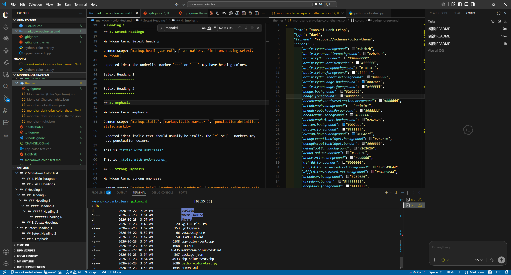
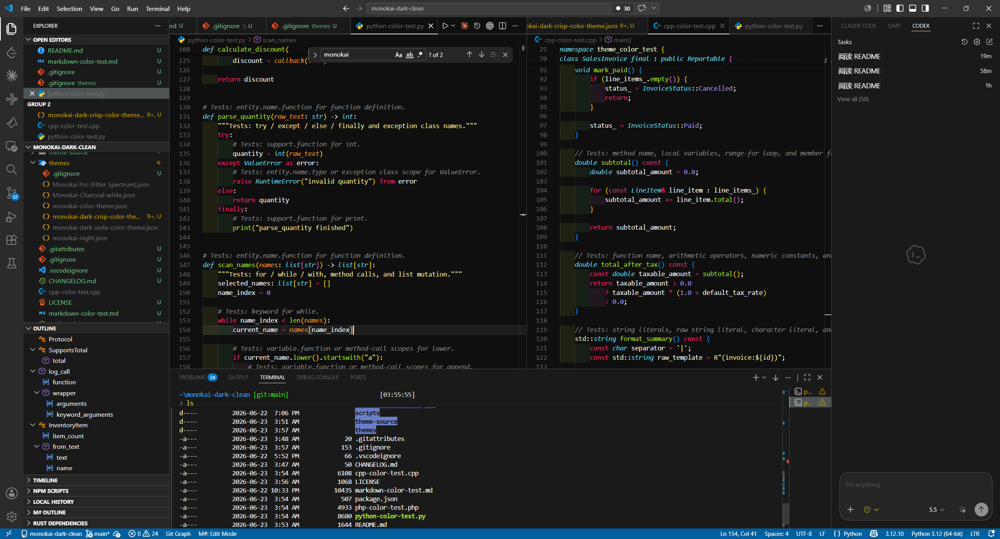
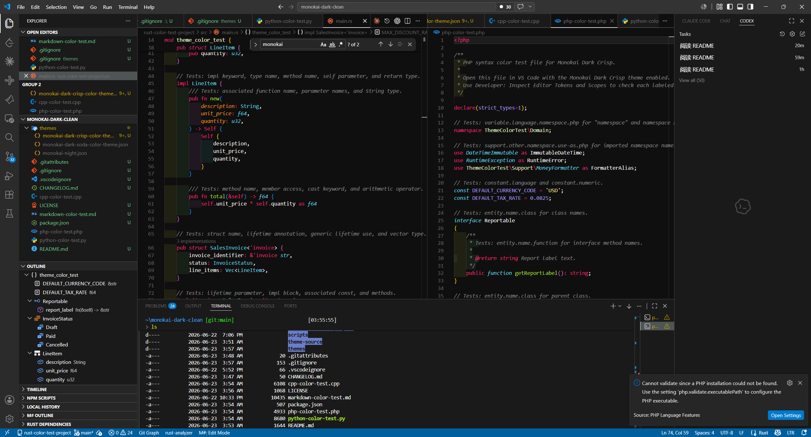

# Monokai Dark Crisp

Monokai Dark Crisp is a high-contrast Monokai dark theme for Visual Studio Code.







## Files

[themes/monokai-dark-crisp-color-theme.json](themes/monokai-dark-crisp-color-theme.json): the theme file loaded by VS Code.

[theme-source/monokai-dark-crisp-tokens.json](theme-source/monokai-dark-crisp-tokens.json): reusable color tokens, such as `surface.gray02`, `border.normal`, and `shell.statusBar`.

[theme-source/monokai-dark-crisp-background-map.json](theme-source/monokai-dark-crisp-background-map.json): maps VS Code color keys to token paths.

[scripts/generate-theme.js](scripts/generate-theme.js): reads the token source and mapping file, resolves token paths to color values, and updates the `colors` section in [themes/monokai-dark-crisp-color-theme.json](themes/monokai-dark-crisp-color-theme.json).

[package.json](package.json): the VS Code extension manifest and npm script definitions.

Example mapping:

```json
{
  "editor.background": "surface.gray02",
  "statusBar.background": "shell.statusBar"
}
```

## Generate the Theme

Run:

```powershell
npm run generate-theme
```

Run this after editing the token source or mapping file.

## Modify the Theme

To update a shared color value, edit [theme-source/monokai-dark-crisp-tokens.json](theme-source/monokai-dark-crisp-tokens.json).

To change which token is used by a VS Code color key, edit [theme-source/monokai-dark-crisp-background-map.json](theme-source/monokai-dark-crisp-background-map.json).

To maintain a color outside the generated mapping, edit [themes/monokai-dark-crisp-color-theme.json](themes/monokai-dark-crisp-color-theme.json) directly.